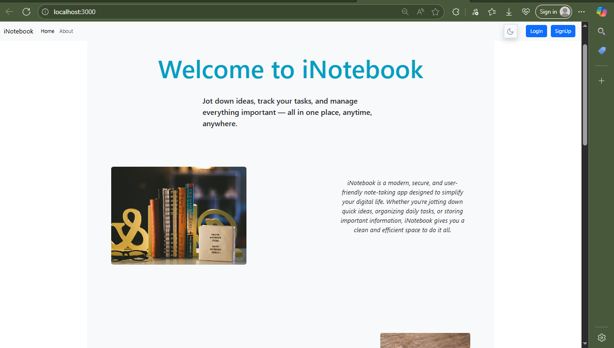
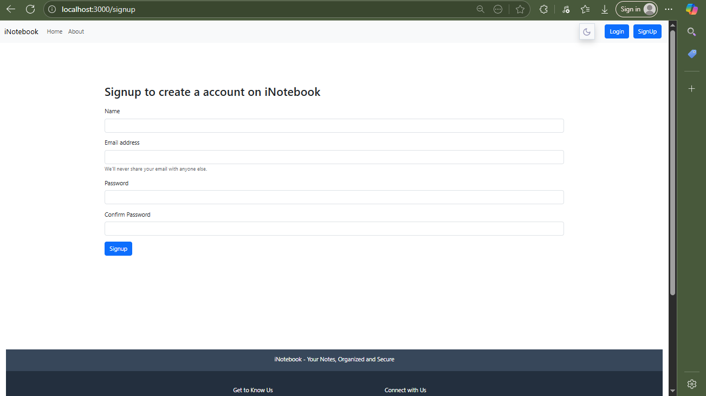

# 📒 iNotebook – Cloud-Based Notes App

**iNotebook** is a secure, full-stack note-taking web application built with **React.js** and **Express.js**. It allows users to create, edit, and manage personal notes stored safely on the cloud with authentication support.  
✨ Just **double-click** on any note’s **title**, **tag**, or **description** to edit it instantly!

---

## 🔗 Live Demo

🌐 Hosted at: [https://inotebook-yourname.netlify.app](https://inotebook-yourname.netlify.app)

> Note: Make sure your backend is also deployed (e.g., Render or Railway) and the frontend `.env` points to it.

---

## 🚀 Features

- 🔐 **User Authentication** (Login/Signup with JWT)
- 📓 **Create, Read, Update, Delete Notes**
- 🖱️ **Double-tap to Edit Notes**
- ☁️ **Cloud-based Storage (MongoDB)**
- 📱 **Responsive Design** for all devices
- ⚡ **Instant UI Updates** with React Context
- 🗂️ **Tag-based Organization**

---

## ✨ Double-Tap Editing

To edit a note, just double-click on:

- 📝 **Title**
- 🏷️ **Tag**
- 📋 **Description**

It instantly becomes editable — a smooth inline editing experience!

---

## 🖼️ Screenshots

> Make sure you have these inside a `/screenshots` folder.

### 🏠 Dashboard  


### 🔐 Login / Signup  


---

## 🧱 Tech Stack

| Frontend           | Backend                | Database |
|--------------------|------------------------|----------|
| React, Bootstrap   | Node.js, Express, JWT  | MongoDB  |

---

## 📁 Folder Structure

project-root/
├── backend/ # Express backend
│ ├── index.js
│ └── ...
├── src/ # React frontend (inside root)
├── public/
├── .env # backend env file
├── .env.local # Frontend env file
└── ...

---


---

## 🔑 Environment Setup

### 🔐 Frontend `.env.local` (in root)

### 🔐 Backend `.env`  

```env.local
REACT_APP_API_BASE_URL=https://your-backend.onrender.com
PORT=****
REACT_APP_EMAILJS_SERVICE_ID=your_service_id
REACT_APP_EMAILJS_TEMPLATE_ID=your_template_id
REACT_APP_EMAILJS_PUBLIC_KEY=your_public_key

To use auto email functionality securely (e.g., using EmailJS or a similar service) and store sensitive values like service_id, template_id, and public_key.

.env
MONGO_DB_URI=your_mongo_connection_string
JWL_SUPER_SECRECT=your_secret_key
PORT=****


```

---

🌍 Hosting
Frontend: Netlify,

Backend: Render